# Badminton Champion League - Database ERD & Schema

## 1. Entity-Relationship Diagram (ERD)

```mermaid
erDiagram
    users ||--o| player_profiles : has
    users ||--o| player_point_balances : has
    users ||--o{ match_players : participates
    users ||--o{ match_invitations : receives
    users ||--o{ match_score_approvals : votes
    users ||--o{ point_transactions : owns
    users ||--o{ season_player_statistics : tracks
    users ||--o{ notifications : receives
    users ||--o{ audit_logs : performs

    seasons ||--o{ matches : categorizes
    seasons ||--o{ season_player_statistics : scopes
    seasons ||--o{ leaderboard_snapshots : archives

    matches ||--o{ match_players : includes
    matches ||--o{ match_scores : records
    matches ||--o{ match_score_versions : versions
    matches ||--o{ match_score_approvals : requires
    matches ||--o{ match_invitations : invites
    matches ||--o{ point_transactions : references

    match_score_versions ||--o{ match_scores : details
    match_score_versions ||--o{ match_score_approvals : references

    users {
        bigint id PK
        string name
        string username UK
        string email UK
        string password
        string phone
        string role "player | admin"
        string status "active | suspended"
        timestamp email_verified_at
        timestamp created_at
        timestamp updated_at
        timestamp deleted_at
    }

    player_profiles {
        bigint id PK
        bigint user_id FK,UK
        string player_id UK
        string photo_url
        string city
        string gender "male | female | other"
        string playing_position "singles | doubles | both"
        text bio
        string visibility "public | members | private"
        timestamp date_joined
    }

    player_point_balances {
        bigint id PK
        bigint user_id FK,UK
        int battle_points "Cannot be negative"
        int rank_points "Can be negative"
        int total_matches
        int total_battle_matches
        int total_ranked_matches
        int total_wins
        int total_losses
        int singles_matches
        int singles_wins
        int doubles_matches
        int doubles_wins
        int current_winning_streak
        int longest_winning_streak
        timestamp created_at
        timestamp updated_at
    }

    seasons {
        bigint id PK
        string name
        string code UK
        date start_date
        date end_date
        boolean is_active
        string status "upcoming | active | completed"
        boolean battle_point_reset
        boolean rank_point_reset
    }

    matches {
        bigint id PK
        string match_code UK
        bigint creator_id FK
        bigint season_id FK
        string match_type "battle | ranked"
        string match_mode "singles | doubles"
        string status "pending_invites | ready | in_progress | waiting_approval | disputed | completed | cancelled"
        date match_date
        time match_time
        string venue
        text description
        string winning_team "team_a | team_b | null"
        boolean ranked_points_deducted "Default false, true once READY"
        text dispute_reason
        bigint disputed_by FK
        timestamp dispute_resolved_at
        bigint dispute_resolved_by FK
        text resolution_notes
    }

    match_players {
        bigint id PK
        bigint match_id FK
        bigint user_id FK
        string team "team_a | team_b"
        string invitation_status "pending | accepted | rejected"
        timestamp responded_at
    }

    match_scores {
        bigint id PK
        bigint match_id FK
        bigint version_id FK
        int set_number
        int team_a_score
        int team_b_score
    }

    match_score_versions {
        bigint id PK
        bigint match_id FK
        int version_number
        bigint submitted_by FK
        string winning_team "team_a | team_b"
        boolean is_active
        timestamp created_at
    }

    match_score_approvals {
        bigint id PK
        bigint match_id FK
        bigint version_id FK
        bigint user_id FK
        string status "pending | approved | disputed"
        text comments
        timestamp voted_at
    }

    point_transactions {
        bigint id PK
        string transaction_code UK
        bigint user_id FK
        bigint match_id FK
        bigint season_id FK
        string point_type "BATTLE | RANK"
        string category "BATTLE_MATCH_WIN | BATTLE_MATCH_LOSS | RANKED_MATCH_ENTRY_DEDUCTION | RANKED_MATCH_WIN | RANKED_MATCH_LOSS | RANKED_MATCH_REFUND | ADMIN_ADJUSTMENT | SEASON_ADJUSTMENT"
        int change_amount
        int previous_balance
        int new_balance
        string description
        string idempotency_key UK
        bigint created_by FK
        timestamp created_at
    }

    notifications {
        bigint id PK
        bigint user_id FK
        string type
        string title
        text message
        json data
        boolean is_read
        timestamp read_at
        timestamp created_at
    }

    audit_logs {
        bigint id PK
        bigint user_id FK
        string action
        string entity_type
        bigint entity_id
        json old_values
        json new_values
        string ip_address
        string user_agent
        text notes
        timestamp created_at
    }
```

---

## 2. Table Indexing & Performance Design

1. **`users`**:
   - `UNIQUE KEY idx_users_username (username)`
   - `UNIQUE KEY idx_users_email (email)`
   - `INDEX idx_users_role_status (role, status)`

2. **`matches`**:
   - `UNIQUE KEY idx_matches_code (match_code)`
   - `INDEX idx_matches_season_status (season_id, status)`
   - `INDEX idx_matches_creator (creator_id)`
   - `INDEX idx_matches_date (match_date, match_time)`

3. **`match_players`**:
   - `UNIQUE KEY idx_unique_match_player (match_id, user_id)`
   - `INDEX idx_match_players_user (user_id)`

4. **`point_transactions`**:
   - `UNIQUE KEY idx_pt_code (transaction_code)`
   - `UNIQUE KEY idx_pt_idempotency (idempotency_key)`
   - `INDEX idx_pt_user_created (user_id, created_at)`
   - `INDEX idx_pt_match (match_id)`

5. **`player_point_balances`**:
   - `UNIQUE KEY idx_ppb_user (user_id)`
   - `INDEX idx_ppb_battle_points (battle_points DESC)`
   - `INDEX idx_ppb_rank_points (rank_points DESC)`
