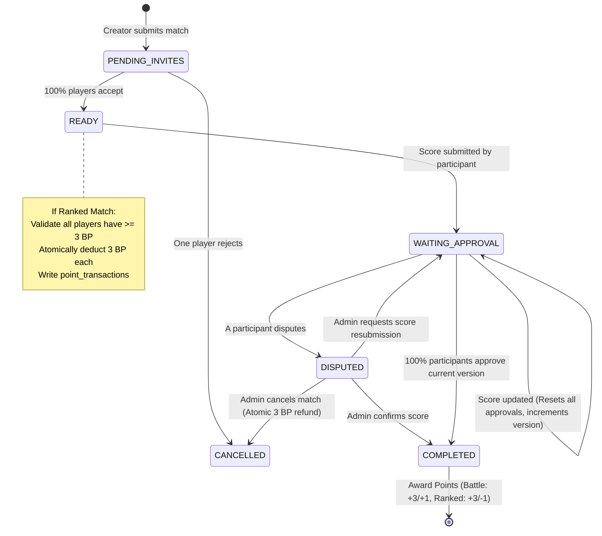

# Badminton Champion League - Match Workflow & Point Engine

## 1. Match State Machine

---

## 2. Point Rules & Invariants

### 2.1 Battle Points (BP)
- **Role:** Participation and activity currency.
- **Match Yield:**
  - Battle Match Win: **+3 BP**
  - Battle Match Loss: **+1 BP**
  - Ranked Match Entry: **-3 BP** (deducted upon reaching `READY`)
- **Invariant:** **Battle Points must NEVER drop below 0.**
  - If a user has 2 BP and attempts to participate in a Ranked Match, the match cannot transition to `READY`.
  - Any transaction resulting in `new_balance < 0` triggers an immediate transactional exception (`BadRequestException`).

### 2.2 Rank Points (RP)
- **Role:** Competitive ranking ladder standing for the active season.
- **Match Yield:**
  - Ranked Match Win: **+3 RP**
  - Ranked Match Loss: **-1 RP**
- **Invariant:** **Rank Points CAN drop below 0.**
  - Negative values (e.g., `-1`, `-4`) are valid, persisted, and accurately displayed on leaderboards and user cards.
  - Reset behavior at season end is configurable per season (`rank_point_reset: true`).

### 2.3 Point Transaction Ledger (`point_transactions`)
Every balance modification must generate an immutable transaction record:
1. `transaction_code`: Human-readable identifier (e.g., `TX-0105-B9F4`).
2. `point_type`: `BATTLE` or `RANK`.
3. `category`:
   - `BATTLE_MATCH_WIN`
   - `BATTLE_MATCH_LOSS`
   - `RANKED_MATCH_ENTRY_DEDUCTION`
   - `RANKED_MATCH_WIN`
   - `RANKED_MATCH_LOSS`
   - `RANKED_MATCH_REFUND`
   - `ADMIN_ADJUSTMENT`
   - `SEASON_ADJUSTMENT`
4. `previous_balance` & `new_balance`: Exact historical snapshots.
5. `idempotency_key`: Sha256-derived deterministic key ensuring no event awards or deducts points more than once.

---

## 3. Score Rules & Validation

Standard Badminton World Federation (BWF) scoring conventions:
1. Best of 3 sets.
2. A team wins a set by reaching at least 21 points with a minimum 2-point margin (e.g., 21-19, 22-20).
3. At 29-all, the first team to reach 30 points wins that set (30-29).
4. The first team to win 2 sets wins the match.
5. Incomplete or ambiguous sets (e.g. 21-20 or 15-12) are rejected by `MatchResultService::validateAndScoreSets()`.
