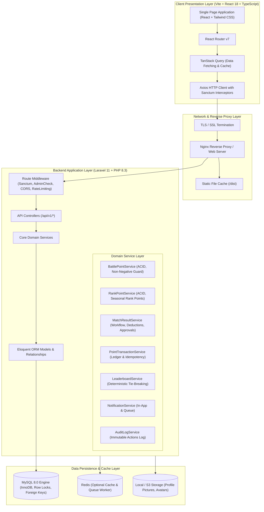

# Badminton Champion League - System Architecture

## 1. Executive Summary

**Badminton Champion League (BCL)** is a high-integrity, competitive sports management platform designed for badminton players, clubs, and leagues. The platform provides:
- Two distinct competitive ladders: **Battle Points (BP)** (participation & activity ladder; never negative) and **Rank Points (RP)** (competitive ranking ladder; negative balances permitted).
- Support for **Singles (1v1)** and **Doubles (2v2)** formats.
- **Atomic 3-BP deduction** at the precise instant a Ranked match reaches `READY` status.
- **100% Unanimous Score Approvals** with immutable score versioning: any score edit immediately resets approvals.
- An **Immutable, Append-Only Point Transaction Ledger** (`point_transactions`) guaranteeing full auditability, row-level locking, and idempotency.
- Administrative arbitration, dispute management, and transparent audit logging.

---

## 2. High-Level Architecture Diagram

---

## 3. Technology Stack Specification

| Component | Technology | Version | Purpose |
|---|---|---|---|
| **Backend Framework** | Laravel | 11.x | Robust MVC, RESTful APIs, Eloquent ORM, Events, Sanctum |
| **PHP Runtime** | PHP | 8.3+ | Strict typing, attributes, match expressions, high performance |
| **Authentication** | Laravel Sanctum | Latest | Token-based API authentication with bearer tokens |
| **Relational Database** | MySQL | 8.0+ | InnoDB storage engine, row-level locks (`lockForUpdate`), foreign keys |
| **Frontend Framework** | React | 18 / 19 | Component-driven declarative UI architecture |
| **Language** | TypeScript | 5.x / 6.x | End-to-end type safety, strict interface contracts |
| **Styling & Design System** | Tailwind CSS | 3.4.x | Modern athletic dark theme, glassmorphic cards, responsive |
| **Data Fetching & Cache** | TanStack Query | v5 | Asynchronous server state synchronization, cache invalidation |
| **Routing** | React Router | v7 | Dynamic client-side routing, protected auth/admin routes |
| **Visualizations** | Recharts | Latest | Interactive SVG charts for player point progression & win rates |
| **Icons** | Lucide React | Latest | Clean, consistent athletic iconography |

---

## 4. Key Architectural Patterns & Guarantees

### 4.1 Strict Domain Service Separation
Business logic is completely decoupled from controllers and frontend views. All mutations concerning points, match states, invitations, and approvals route through dedicated singleton domain services:
1. `MatchResultService`: Manages creation, acceptance, deduction, score recording, approval voting, disputes, and cancellations.
2. `BattlePointService`: Enforces the invariant that Battle Points **cannot drop below zero**.
3. `RankPointService`: Calculates competitive ladder standings; permits negative values.
4. `PointTransactionService`: Writes permanent audit records with idempotency hashes.
5. `LeaderboardService`: Provides deterministic sorting with multi-tier tie-breaking.

### 4.2 ACID Guarantees & Concurrency Control
All critical operations (such as Ranked match deductions and score approval point allocations) are wrapped in `DB::transaction()` blocks. When reading balances before deduction, the system utilizes `lockForUpdate()` on `player_point_balances` rows, preventing race conditions, double entry, or concurrent overdrafts.

### 4.3 Immutable Versioning & Approval Invalidation
Scores are stored in versioned entities (`match_score_versions`). Each approval references a specific `match_score_version_id`. If any participant updates the score:
- A new version is created.
- The previous version is marked superseded.
- All approvals on the old version become void.
- Match state reverts to `WAITING_APPROVAL`.
- Points are never awarded until 100% of participants approve the active version.
